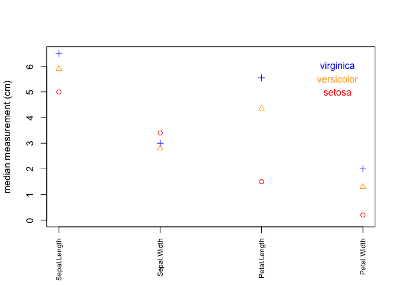
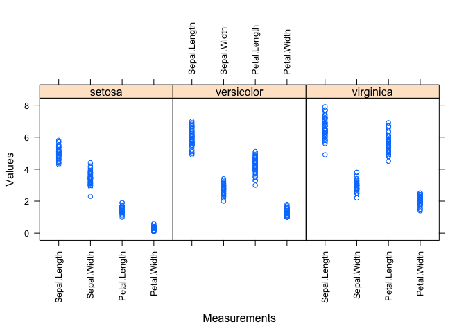
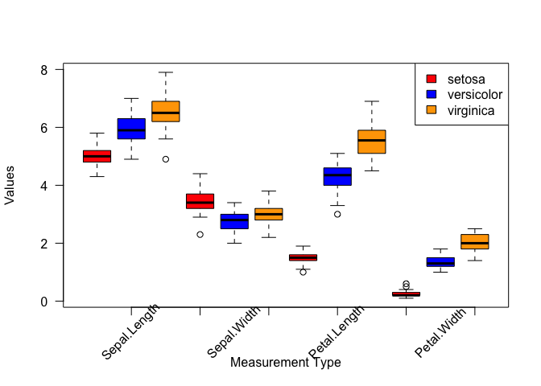

There is more than one way to solve each of these challenges, and not all solutions for each challenge are provided.

### mtcars


```r
# using only functions already seen
mtcars_avg <- colSums(mtcars) / nrow(mtcars)
mtcars2 <- rbind(mtcars, mtcars_avg)
rownames(mtcars2) <- c(rownames(mtcars), "avg")
mtcars2$hp.gt.100 <- mtcars2$hp > 100
mtcars2

# simplified
mtcars3 <- rbind(mtcars, "avg" = colMeans(mtcars))
mtcars3$hp.gt.100 <- mtcars3$hp > 100
mtcars3
```

### iris


```r
table(iris[iris$Sepal.Length > 6, "Species"])

# a data frame with two columns: species and sepal + petal
data.frame(Species = iris$Species,
           Length.Sum = iris$Sepal.Length + iris$Petal.Length)
```

### min max normalization

```r
# make small version of data2 to test formula
data3 <- data2[c(1:3),c(1:3)]
data3
minMaxNormalize <- function(x) {(x - min(x)) / (max(x) - min(x))}
t(apply(data3, 1, minMaxNormalize))
```

### log2-fold change


```r
# add one to all values to avoid taking log of 0 and division by zero
data4 <- t(apply(data3, 1, minMaxNormalize)) + 1
data4
log2FoldChange <- function(a,b) {log2(a / b)}
# for all genes between any two samples
mapply(log2FoldChange, data4[,"C61"], data4[,"C62"])
# for all genes between one sample and all other samples
apply(data4[,-1], 2, function(b) {log2FoldChange(data4[,1], b)})

# or more generally
lfcSample <- function(X, c) {
  lfc = log2FoldChange(X[,c], X[,-c])
  colnames(lfc) = paste("lfc", colnames(X)[c], colnames(lfc), sep = ".")
  lfc}

lfcSample(data4, 1)
# all genes, all sample comparisons
## with a for loop
for (i in 1:ncol(data4)) {
  print(lfcSample(data4, i))
}
## with an apply function
lapply(seq(dim(data4)[2]), function(c) {lfcSample(data4, c)})
```

### final challenge


```r
median.iris <- sapply(1:4, function(x){tapply(iris[,x], iris[[5]], median)})
colnames(median.iris) <- colnames(iris)[c(1:4)]
median.iris
```

#### fig. 1: measurement medians


```r
x <- seq(1:ncol(median.iris))
# set up shape, color, and label values for points
points.iris <- data.frame(label = rownames(median.iris),
                          shape = seq(1:nrow(median.iris)),
                          color = c("red", "orange", "blue"))
rownames(points.iris) <- rownames(median.iris)
# create a blank plot background with no x-axis text or points plotted
plot(x,
     type = "n",
     xaxt = "n",
     xlim = c(1, ncol(median.iris)),
     ylim = c(0, max(median.iris)),
     xlab = "",
     ylab = "median measurement (cm)")
# add measurement type labels to x-axis, perpendicular, smaller font
axis(1, at = x, labels = colnames(median.iris), las = 2, cex.axis = 0.75)
# add points
points(x, median.iris[1,], pch = points.iris$shape[1], col = points.iris$color[1])
points(x, median.iris[2,], pch = points.iris$shape[2], col = points.iris$color[2])
points(x, median.iris[3,], pch = points.iris$shape[3], col = points.iris$color[3])
text(c(3.75, 3.75, 3.75), c(5, 5.5, 6), labels = points.iris$label, col = points.iris$color, cex = 1)
```

<!-- -->

#### fig. 2: scatter plot of measurement data for each species


```r
# lattice plot
if (!any(rownames(installed.packages()) == "lattice")){
  install.packages("lattice")
}
library(lattice)

if (!any(rownames(installed.packages()) == "reshape2")){
  install.packages("reshape2")
}
library(reshape2)
# create a new dataframe using melt function from reshape2
dd <- melt(iris)
xyplot(value ~ variable | Species, data=dd, scales=list(x=list(rot=90)), xlab="Measurements", ylab="Values")
```

<!-- -->

#### fig.3: boxplot of measurement data


```r
# boxplot by group
cols <- c("red", "blue", "orange")
boxplot(value ~ Species + variable, data=dd, col = cols, xaxt="n", yaxt="n", xlab="Measurement Type", ylab="Values")
axis(side=1, labels=FALSE)
axis(side=2, las=2)
text(x=1:12, y=par("usr")[3] - 0.85, labels=c("", "Sepal.Length", "", "", "Sepal.Width", "", "", "Petal.Length", "", "", "Petal.Width", ""), xpd=NA, srt=45, cex=1)
legend("topright", fill=cols, legend=levels(dd$Species))
```

<!-- -->
