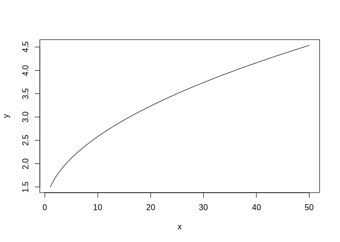
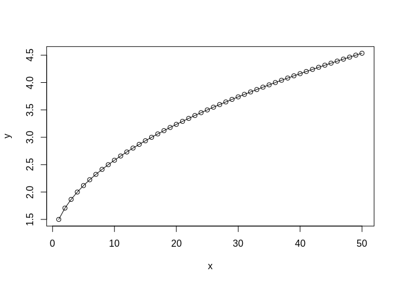
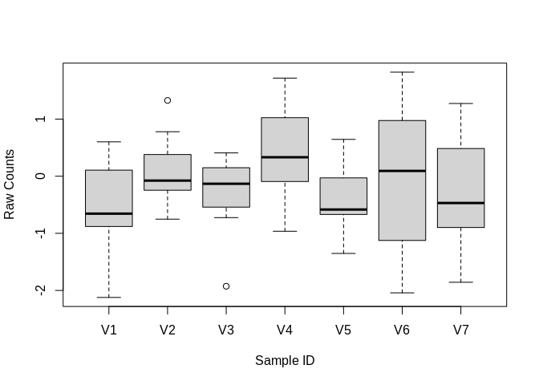
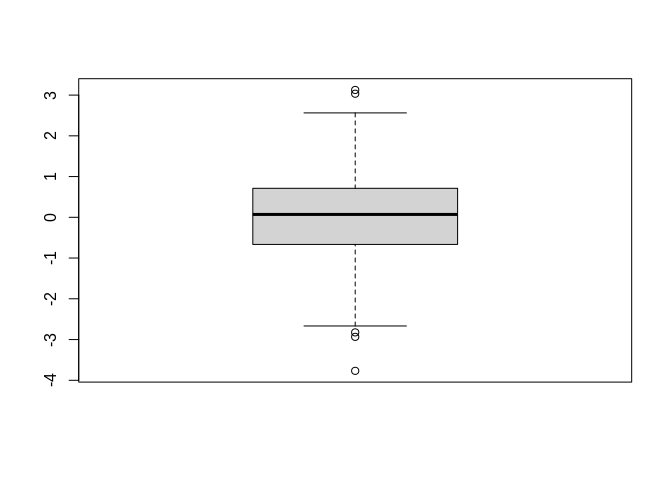
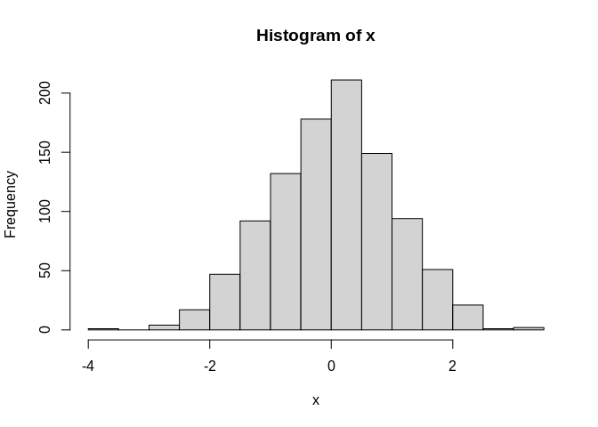
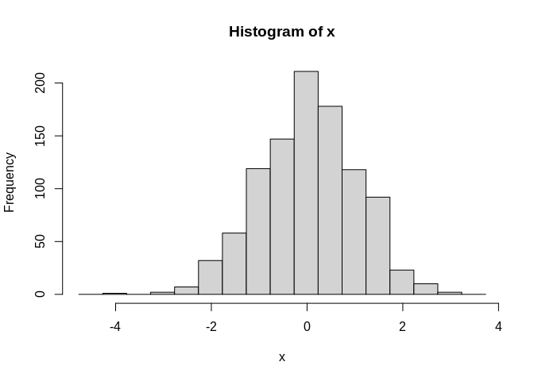
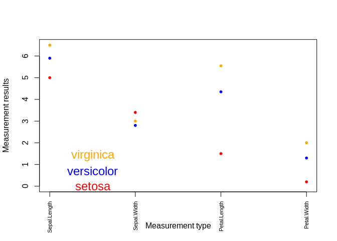
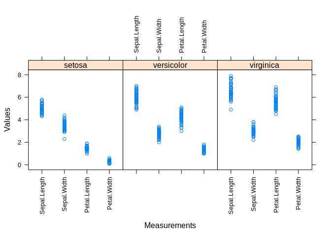
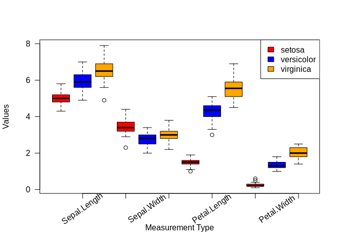

---
output:
    html_document:
        keep_md: TRUE
---

<script src="../assets/js/quiz.js"></script>

<style type="text/css">
.colsel {
background-color: lightyellow;
}

pre, code {
  white-space:pre !important;
  overflow-x:scroll auto
}
</style>


# Intro to R Day 3

---

Load your day 2 workspace data:

```{.r .colsel}
load("day2.RData")
```


### Loops

In programming, it is common that one has to do one set of specific operation on a sequence of elements. In this case, *for* loop is very useful to achieve the goal.

The basic structure of *for* loop is:

**for (value in sequence){**

  **some operation**

**}**


For example, we would like to calculate the sum of a row for every row in the matrix we created earlier. We are going to use a *for* loop to do it.


```{.r .colsel}
for (i in 1:dim(my_matrix)[1]) {
  out <- sum(my_matrix[i, ])
  print(out)
}
```

```
## [1] 11
## [1] 58
## [1] 302
## [1] 38
```

There is a **while** loop in R similarly as in command line or any other programming language. The basic structure of a *while* loop is:

**while (condition){**

  **some operation**

**}**


Here is the same row sum calculation using a while loop:


```{.r .colsel}
while (i <= dim(my_matrix)[1]){
  out <- sum(my_matrix[i,])
  print(out)
  i <- i + 1
}
```

```
## [1] 38
```


<br>

---

### The "apply" family of functions

#### A few useful functions: apply(), lapply(), sapply(), and tapply() to replace for loop

##### apply() takes an array or matrix as input and outputs a vector, array or list.


```{.r .colsel}
# recall my_matrix
my_matrix
```

```
##      col1 col2 col3
## row1    1    2    8
## row2    3   18   37
## row3    8   27  267
## row4    9   10   19
```

```{.r .colsel}
# check the usage of apply() function
?apply()
# calculate sums for each row
apply(my_matrix, MARGIN=1, sum)
```

```
## row1 row2 row3 row4 
##   11   58  302   38
```


##### lapply() takes a list, vector or data frame as input and outputs a list.


```{.r .colsel}
?lapply()

# generate some random data matrix
data3 <- as.data.frame(matrix(rnorm(49), ncol=7), stringsAsFactors=F)
dim(data3)
```

```
## [1] 7 7
```

```{.r .colsel}
# calculate the sum for each row
lapply(1:dim(data3)[1], function(x){sum(data3[x,])})
```

```
## [[1]]
## [1] 0.06201155
## 
## [[2]]
## [1] -5.559323
## 
## [[3]]
## [1] -3.540024
## 
## [[4]]
## [1] -4.56483
## 
## [[5]]
## [1] -0.2144674
## 
## [[6]]
## [1] 4.154387
## 
## [[7]]
## [1] 2.237189
```

```{.r .colsel}
# comparing the results to apply() results
apply(data3, MARGIN=1, sum)
```

```
## [1]  0.06201155 -5.55932253 -3.54002380 -4.56483039 -0.21446740  4.15438732
## [7]  2.23718887
```

```{.r .colsel}
# calculate log10 of the sum of each row
lapply(1:dim(data3)[1], function(x){log10(sum(data3[x,]))})
```

```
## Warning in FUN(X[[i]], ...): NaNs produced

## Warning in FUN(X[[i]], ...): NaNs produced

## Warning in FUN(X[[i]], ...): NaNs produced

## Warning in FUN(X[[i]], ...): NaNs produced
```

```
## [[1]]
## [1] -1.207527
## 
## [[2]]
## [1] NaN
## 
## [[3]]
## [1] NaN
## 
## [[4]]
## [1] NaN
## 
## [[5]]
## [1] NaN
## 
## [[6]]
## [1] 0.618507
## 
## [[7]]
## [1] 0.3497026
```

##### The function sapply() works like function lapply(), but tries to simplify the output to the simplest data structure possible. As a matter of fact, sapply() is a "wrapper" function for lapply(). By default, it returns a vector.


```{.r .colsel}
# To check the syntax of using sapply():
?sapply()

sapply(1:dim(data3)[1], function(x){log10(sum(data3[x,]))})
```

```
## Warning in FUN(X[[i]], ...): NaNs produced

## Warning in FUN(X[[i]], ...): NaNs produced

## Warning in FUN(X[[i]], ...): NaNs produced

## Warning in FUN(X[[i]], ...): NaNs produced
```

```
## [1] -1.2075274        NaN        NaN        NaN        NaN  0.6185070  0.3497026
```

##### If the "simplify" parameter is turned off, sapply() will produced exactly the same results as lapply(), in the form of a list. By default, "simplify" is turned on.

```{.r .colsel}
sapply(1:dim(data3)[1], function(x){log10(sum(data3[x,]))}, simplify=FALSE)
```

```
## Warning in FUN(X[[i]], ...): NaNs produced

## Warning in FUN(X[[i]], ...): NaNs produced

## Warning in FUN(X[[i]], ...): NaNs produced

## Warning in FUN(X[[i]], ...): NaNs produced
```

```
## [[1]]
## [1] -1.207527
## 
## [[2]]
## [1] NaN
## 
## [[3]]
## [1] NaN
## 
## [[4]]
## [1] NaN
## 
## [[5]]
## [1] NaN
## 
## [[6]]
## [1] 0.618507
## 
## [[7]]
## [1] 0.3497026
```

#### The function tapply() applys a function to each subset of a vector based on a second vector of factors.


```{.r .colsel}
?tapply()

# Let's use Fisher's Iris data to demonstrate the usage of tapply().
# First, load the Iris dataset
data(iris)

# Take a look at what the data includes
head(iris)
```

```
##   Sepal.Length Sepal.Width Petal.Length Petal.Width Species
## 1          5.1         3.5          1.4         0.2  setosa
## 2          4.9         3.0          1.4         0.2  setosa
## 3          4.7         3.2          1.3         0.2  setosa
## 4          4.6         3.1          1.5         0.2  setosa
## 5          5.0         3.6          1.4         0.2  setosa
## 6          5.4         3.9          1.7         0.4  setosa
```

```{.r .colsel}
# Generate a summary of the sepal lengths for each iris species.
tapply(iris$Sepal.Length, iris$Species, summary)
```

```
## $setosa
##    Min. 1st Qu.  Median    Mean 3rd Qu.    Max. 
##   4.300   4.800   5.000   5.006   5.200   5.800 
## 
## $versicolor
##    Min. 1st Qu.  Median    Mean 3rd Qu.    Max. 
##   4.900   5.600   5.900   5.936   6.300   7.000 
## 
## $virginica
##    Min. 1st Qu.  Median    Mean 3rd Qu.    Max. 
##   4.900   6.225   6.500   6.588   6.900   7.900
```


### User defined functions

Even though there are a lot of R packages available, there are always situations where one might have to write one's own function to accomplish some very specific goals. Functions are defined by code with a specific format:


```{.r .colsel}
function.name <- function(arg1=arg1, arg2, ...){
	var <- sin(arg1) + sin(arg2)  # carry out tasks
	var / 2
}
```

Here, we are going to write a function to calculate the area of a triangle given the lengths of three sides.


```{.r .colsel}
my.area <- function(side1=side1, side2=side2, side3=side3){
	circumference <- (side1 + side2 + side3) / 2
	area <- sqrt(circumference * (circumference - side1) * (circumference - side2) * (circumference - side3))
	return(area)
}

# let's carry out some test
my.area(side1=3, side2=4, side3=5)
```

```
## [1] 6
```

<br>

## Quiz 5

<div id="quiz5" class="quiz"></div>
<button id="submit5">Submit Quiz</button>
<div id="results5" class="output"></div>
<script>
quizContainer5 = document.getElementById('quiz5');
resultsContainer5 = document.getElementById('results5');
submitButton5 = document.getElementById('submit5');

myQuestions5 = [
  {
    question: "Find the area of a triangle with sides 32, 22, and 40:",
    answers: {
      a: "352.3445",
      b: "351.2478",
      c: "350.2112",
      d: "354.7849"
    },
    correctAnswer: "b"
  },
  {
    question: "Use the 'sd' function along with sapply to get the standard deviation for every row in data1. Then find the maximum of those values:",
    answers: {
      a: "26106.23",
      b: "26107.23",
      c: "26108.23",
      d: "26105.23"
    },
    correctAnswer: "a"
  },
  {
    question: "Now, using the apply function find only those rows whose standard deviation is greater than 20000. What is the row name?",
    answers: {
      a: "AT1G21310",
      b: "AT3G09260",
      c: "AT1G67090",
      d: "AT3G53420"
    },
    correctAnswer: "b"
  }
];

buildQuiz(myQuestions5, quizContainer5);
submitButton5.addEventListener('click', function() {showResults(myQuestions5, quizContainer5, resultsContainer5);});
</script>

---


## CHALLENGE

Write a function to calculate min-max normalization for a single row. Here is the formula:


Then use apply to normalize every row of data2. You might want to take a small piece of data2 to test it with, e.g. the first 3 rows and first 3 columns.

## HARD CHALLENGE

Now take your normalized data and write a function to find the log2-fold change (i.e. the log of the ratio of normalized counts) between any two samples across all genes. Then use one of the apply functions to calculate log2-fold change across ALL samples, given one sample. Finally, use a for loop to find the pair-wise log2-fold changes for every pair of samples.


Topic 6. Basic statistics in R
====================================================

<table class="table table-striped table-hover table-responsive" style="width: auto !important; margin-left: auto; margin-right: auto;">
 <thead>
  <tr>
   <th style="text-align:center;"> Description </th>
   <th style="text-align:center;"> R_function </th>
  </tr>
 </thead>
<tbody>
  <tr>
   <td style="text-align:center;"> Mean </td>
   <td style="text-align:center;"> mean() </td>
  </tr>
  <tr>
   <td style="text-align:center;"> Standard deviation </td>
   <td style="text-align:center;"> sd() </td>
  </tr>
  <tr>
   <td style="text-align:center;"> Variance </td>
   <td style="text-align:center;"> var() </td>
  </tr>
  <tr>
   <td style="text-align:center;"> Minimum </td>
   <td style="text-align:center;"> min() </td>
  </tr>
  <tr>
   <td style="text-align:center;"> Maximum </td>
   <td style="text-align:center;"> max() </td>
  </tr>
  <tr>
   <td style="text-align:center;"> Median </td>
   <td style="text-align:center;"> median() </td>
  </tr>
  <tr>
   <td style="text-align:center;"> Range of values: minimum and maximum </td>
   <td style="text-align:center;"> range() </td>
  </tr>
  <tr>
   <td style="text-align:center;"> Sample quantiles </td>
   <td style="text-align:center;"> quantile() </td>
  </tr>
  <tr>
   <td style="text-align:center;"> Generic function </td>
   <td style="text-align:center;"> summary() </td>
  </tr>
  <tr>
   <td style="text-align:center;"> Interquartile range </td>
   <td style="text-align:center;"> IQR() </td>
  </tr>
</tbody>
</table>

Calculate the mean expression for each sample.


```{.r .colsel}
apply(data3, 2, mean)
```

```
##          V1          V2          V3          V4          V5          V6 
## -0.53190648  0.10985395 -0.34780143  0.42192082 -0.38358330 -0.06082095 
##          V7 
## -0.26838496
```

Calculate the range of expression for each sample.


```{.r .colsel}
apply(data3, 2, range)
```

```
##              V1         V2         V3         V4         V5        V6        V7
## [1,] -2.1225589 -0.7515701 -1.9265720 -0.9636053 -1.3522608 -2.042141 -1.856143
## [2,]  0.6021828  1.3272179  0.4080706  1.7183416  0.6456275  1.822219  1.272969
```

Calculate the quantiles of each samples.


```{.r .colsel}
apply(data3, 2, quantile)
```

```
##              V1          V2         V3          V4          V5          V6
## 0%   -2.1225589 -0.75157007 -1.9265720 -0.96360526 -1.35226078 -2.04214080
## 25%  -0.8803357 -0.24527545 -0.5412279 -0.09263055 -0.66900312 -1.12471576
## 50%  -0.6549889 -0.07667717 -0.1321835  0.33251788 -0.58329603  0.09257517
## 75%   0.1063455  0.38027895  0.1492653  1.02572634 -0.02857375  0.97551591
## 100%  0.6021828  1.32721793  0.4080706  1.71834156  0.64562747  1.82221868
##              V7
## 0%   -1.8561426
## 25%  -0.8980545
## 50%  -0.4691785
## 75%   0.4848832
## 100%  1.2729688
```


---

Topic 7. Simple data visulization in R
====================================================

Scatter plot and line plot can be produced using the function plot().


```{.r .colsel}
x <- c(1:50)
y <- 1 + sqrt(x)/2
plot(x,y)
```

<!-- -->

```{.r .colsel}
plot(x,y, type="l")
```

<!-- -->

```{.r .colsel}
# plot both the points and lines
## first plot points
plot(x,y)
lines(x,y, type="l")
```

<!-- -->

```{.r .colsel}
## lines() can only be used to add information to a graph, while it cannot produce a graph on its own.
```


boxplot() can be used to summarize data.


```{.r .colsel}
boxplot(data3, xlab="Sample ID", ylab="Raw Counts")
```

<!-- -->


```{.r .colsel}
x <- rnorm(1000)
boxplot(x)
```

<!-- -->

hist() can be used to create histograms of data.

```{.r .colsel}
hist(x)
```

<!-- -->

```{.r .colsel}
# use user defined break points
hist(x, breaks=seq(range(x)[1]-1, range(x)[2]+1, by=0.5))
```

<!-- -->


```{.r .colsel}
# clear plotting device/area
dev.off()
```

```
## null device 
##           1
```


---

Topic 8. Install packages in R
====================================================

##### Starting from Bioconductor version 3.8, the installation of packages is recommended to use BiocManager.


```{.r .colsel}
if (!requireNamespace("BiocManager"))
	install.packages("BiocManager")
## install core packages
BiocManager::install()
## install specific packages
BiocManager::install(c("devtools", "tidyverse","bsseq","DSS"))
```

* Bioconductor has a repository and release schedule that differ from R (Bioconductor has a ‘devel’ branch to which new packages and updates are introduced, and a stable ‘release’ branch emitted once every 6 months to which bug fixes but not new features are introduced). This mismatch causes that the version detected by install.packages() is sometimes not the most recent 'release'.

* A consequence of the distinct 'devel' branch is that install.packages() sometimes points only to the 'release' repository, while users might want to have access to the leading-edge features in the develop version.

* An indirect consequence of Bioconductor's structured release is that packages generally have more extensive dependences with one another.


##### <font color='orange'>It is always recommended to update to the most current version of R and Bioconductor. If it is not possible and R < 3.5.0, please use the legacy approach to install Bioconductor packages</font>   


```{.r .colsel}
source("http://bioconductor.org/biocLite.R")
## install core packages
biocLite()
## install specific packages
biocLite(c("devtools", "tidyverse","bsseq","DSS"))
```
   
##### The R function install.packages() can be used to install packages that are not part of Bioconductor.


```{.r .colsel}
install.packages("ggplot2", repos="http://cran.us.r-project.org")
install.packages(c("kableExtra","knitr","dplyr"))
```

##### Install from source of github.

```{.r .colsel}
library(devtools)
install_github("stephenturner/qqman")
```


---

Topic 9. Save data in R session
====================================================

#### To save history in R session


```{.r .colsel}
#savehistory(file="Oct08.history")

#loadhistory(file="Oct08.history")
```

#### To save objects in R session


```{.r .colsel}
save(list=c("x", "data"), file="Oct08.RData")

#load("Oct08.RData")
```

---

<font color='blue'>Final challenge</font>
====================================================

Working with an R notebook, load the Iris data as we did earlier in this documentation, generate a table that lists the median of each measurement (Sepal.Length, Sepal.Width, Petal.Length, Petal.Width) for each species. Then generate a plot based on the result. Finally produce an html report with the table and the plot. Below serves as an example output.


<table class="table table-striped table-hover table-responsive" style="width: auto !important; margin-left: auto; margin-right: auto;">
 <thead>
  <tr>
   <th style="text-align:left;">   </th>
   <th style="text-align:center;"> Sepal.Length </th>
   <th style="text-align:center;"> Sepal.Width </th>
   <th style="text-align:center;"> Petal.Length </th>
   <th style="text-align:center;"> Petal.Width </th>
  </tr>
 </thead>
<tbody>
  <tr>
   <td style="text-align:left;"> setosa </td>
   <td style="text-align:center;"> 5.0 </td>
   <td style="text-align:center;"> 3.4 </td>
   <td style="text-align:center;"> 1.50 </td>
   <td style="text-align:center;"> 0.2 </td>
  </tr>
  <tr>
   <td style="text-align:left;"> versicolor </td>
   <td style="text-align:center;"> 5.9 </td>
   <td style="text-align:center;"> 2.8 </td>
   <td style="text-align:center;"> 4.35 </td>
   <td style="text-align:center;"> 1.3 </td>
  </tr>
  <tr>
   <td style="text-align:left;"> virginica </td>
   <td style="text-align:center;"> 6.5 </td>
   <td style="text-align:center;"> 3.0 </td>
   <td style="text-align:center;"> 5.55 </td>
   <td style="text-align:center;"> 2.0 </td>
  </tr>
</tbody>
</table>

<!-- --><!-- --><!-- -->


#### <font color='red'>Hints: </font>

* In order to output a nice looking table in the final report, one may consider the R package kableExtra https://github.com/haozhu233/kableExtra. One may also check out the documentation at https://cran.r-project.org/web/packages/htmlTable/vignettes/

* Figure 1 can be produced using base R functions: plot(), points(), axis(), text().

* Figure 2 can be produced using functions in R package lattice https://cran.r-project.org/web/packages/lattice/index.html

* Figure 3 can be produced using function boxplot()

#### **Solution:**


<!--html_preserve--><a href="data:text/x-markdown;base64,LS0tCnRpdGxlOiAiU29sdXRpb24gZm9yIHRoZSBGaW5hbCBDaGFsbGVuZ2UiCm91dHB1dDoKICBodG1sX25vdGVib29rOgogICAgY29kZV9mb2xkaW5nOiBoaWRlCi0tLQoKCiMjIyMgKipUYWJsZSAxLioqIG1lYW4gbWVhc3VyZW1lbnRzCmBgYHtyIGVjaG89VFJVRSwgbWVzc2FnZT1GQUxTRSwgd2FybmluZz1GQUxTRSwgZXJyb3I9RkFMU0V9CmlmICghYW55KHJvd25hbWVzKGluc3RhbGxlZC5wYWNrYWdlcygpKSA9PSAia2FibGVFeHRyYSIpKXsKICBpbnN0YWxsLnBhY2thZ2VzKCJrYWJsZUV4dHJhIikKfQpsaWJyYXJ5KGthYmxlRXh0cmEpCgpkYXRhKGlyaXMpCnRtcCA8LSBzYXBwbHkoMTo0LCBmdW5jdGlvbih4KXt0YXBwbHkoaXJpc1sseF0sIGlyaXNbWzVdXSwgbWVkaWFuKX0pCmNvbG5hbWVzKHRtcCkgPC0gY29sbmFtZXMoaXJpcylbMTo0XQpubXMgPC0gY29sbmFtZXModG1wKQp0YiA8LSBrYWJsZShkYXRhLmZyYW1lKHRtcCwgc3RyaW5nc0FzRmFjdG9ycz1GKSwgYWxpZ249J2MnKQprYWJsZV9zdHlsaW5nKHRiLCBib290c3RyYXBfb3B0aW9ucz1jKCJzdHJpcGVkIiwgImhvdmVyIiwgInJlc3BvbnNpdmUiKSwgZnVsbF93aWR0aD1GLCBwb3NpdGlvbj0iY2VudGVyIikKYGBgCgojIyMjICoqRmlndXJlIDEuKiogUGxvdCBvZiB0aGUgZGF0YSBmcm9tIHRoZSB0YWJsZSBhYm92ZQoKYGBge3IgZWNobz1UUlVFLCBtZXNzYWdlPUZBTFNFLCB3YXJuaW5nPUZBTFNFLCBlcnJvcj1GQUxTRX0KIyBwbG90IG1lYW4Kc3BlY2llcyA8LSBsZXZlbHMoaXJpcyRTcGVjaWVzKQp4IDwtIGMoMSwgMiwgMywgNCkKcGxvdCh4LCB0bXBbInNldG9zYSIsXSwgcGNoPTIwLCBjb2w9J3JlZCcsIHlsaW09YygwLCBtYXgodG1wKSksIHhheHQ9Im4iLCB4bGFiPSJNZWFzdXJlbWVudCB0eXBlIiwgeWxhYj0iTWVhc3VyZW1lbnQgcmVzdWx0cyIsIGNleC5sYWI9MS4wKQpwb2ludHMoeCwgdG1wWyJ2aXJnaW5pY2EiLF0sIHBjaD0yMCwgY29sPSdvcmFuZ2UnKQpwb2ludHMoeCwgdG1wWyJ2ZXJzaWNvbG9yIixdLCBwY2g9MjAsIGNvbD0nYmx1ZScpCmF4aXMoMSwgYXQ9eCwgbGFiZWxzPW5tcywgbGFzPTIsIGNleC5heGlzPTAuNykKdGV4dChjKDEuNSwxLjUsMS41KSwgYygwLCAwLjcsIDEuNCksIGxhYmVscz1zcGVjaWVzLCBjb2w9YygicmVkIiwgImJsdWUiLCAib3JhbmdlIiksIGNleD0xLjUpCmBgYAoKIyMjIyAqKkZpZ3VyZSAyLioqIFNjYXR0ZXIgcGxvdCBvZiBtZWFzdXJlbWVudCBkYXRhIGZvciBlYWNoIHNwZWNpZXMKCmBgYHtyIGVjaG89VFJVRSwgbWVzc2FnZT1GQUxTRSwgd2FybmluZz1GQUxTRSwgZXJyb3I9RkFMU0V9CiMgbGF0dGljZSBwbG90CmlmICghYW55KHJvd25hbWVzKGluc3RhbGxlZC5wYWNrYWdlcygpKSA9PSAibGF0dGljZSIpKXsKICBpbnN0YWxsLnBhY2thZ2VzKCJsYXR0aWNlIikKfQpsaWJyYXJ5KGxhdHRpY2UpCgppZiAoIWFueShyb3duYW1lcyhpbnN0YWxsZWQucGFja2FnZXMoKSkgPT0gInJlc2hhcGUyIikpewogIGluc3RhbGwucGFja2FnZXMoInJlc2hhcGUyIikKfQpsaWJyYXJ5KHJlc2hhcGUyKQoKIyBjcmVhdGUgYSBuZXcgZGF0YWZyYW1lIHVzaW5nIG1lbHQgZnVuY3Rpb24gZnJvbSByZXNoYXBlMgpkZCA8LSBtZWx0KGlyaXMpCnh5cGxvdCh2YWx1ZSB+IHZhcmlhYmxlIHwgU3BlY2llcywgZGF0YT1kZCwgc2NhbGVzPWxpc3QoeD1saXN0KHJvdD05MCkpLCB4bGFiPSJNZWFzdXJlbWVudHMiLCB5bGFiPSJWYWx1ZXMiKQpgYGAKCiMjIyMgKipGaWd1cmUgMy4qKiBCb3hwbG90IG9mIG1lYXN1cmVtZW50IGRhdGEKCmBgYHtyIGVjaG89VFJVRSwgbWVzc2FnZT1GQUxTRSwgd2FybmluZz1GQUxTRSwgZXJyb3I9RkFMU0V9CiMgYm94cGxvdCBieSBncm91cApjb2xzIDwtIGMoInJlZCIsICJibHVlIiwgIm9yYW5nZSIpCmJveHBsb3QodmFsdWUgfiBTcGVjaWVzICsgdmFyaWFibGUsIGRhdGE9ZGQsIGNvbCA9IGNvbHMsIHhheHQ9Im4iLCB5YXh0PSJuIiwgeGxhYj0iTWVhc3VyZW1lbnQgVHlwZSIsIHlsYWI9IlZhbHVlcyIpCmF4aXMoc2lkZT0xLCBsYWJlbHM9RkFMU0UpCmF4aXMoc2lkZT0yLCBsYXM9MikKdGV4dCh4PTE6MTIsIHk9cGFyKCJ1c3IiKVszXSAtIDAuODUsIGxhYmVscz1jKCIiLCAiU2VwYWwuTGVuZ3RoIiwgIiIsICIiLCAiU2VwYWwuV2lkdGgiLCAiIiwgIiIsICJQZXRhbC5MZW5ndGgiLCAiIiwgIiIsICJQZXRhbC5XaWR0aCIsICIiKSwgeHBkPU5BLCBzcnQ9NDUsIGNleD0xKQpsZWdlbmQoInRvcHJpZ2h0IiwgZmlsbD1jb2xzLCBsZWdlbmQ9bGV2ZWxzKGRkJFNwZWNpZXMpKQoKYGBgCgoKCg==" download="solution.Rmd">Download solution.Rmd</a><!--/html_preserve-->


<br>


